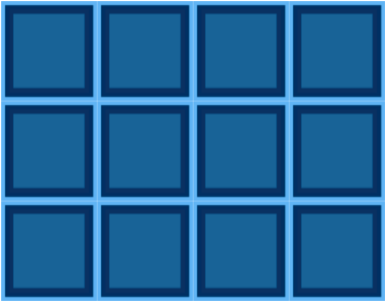
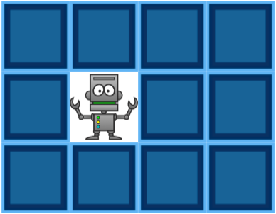
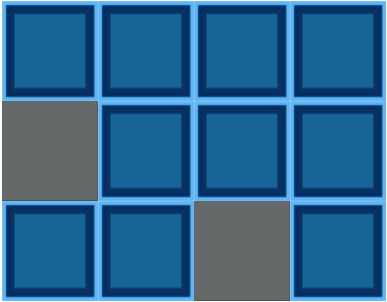
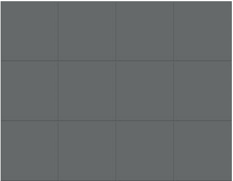

# memory-game
A small memory game using javascript

### How to run

  npm i

  npm run dev

### Screenshots

#### Game start

#### Tile Selection

#### After finding a successful matching tile

#### Game complete

